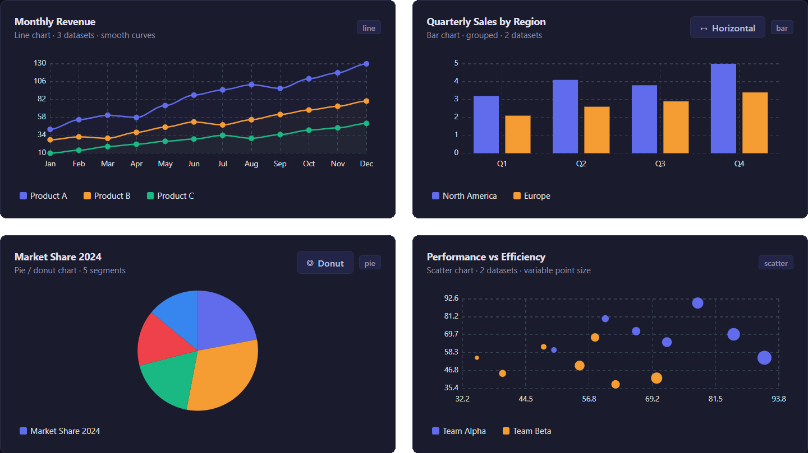

<p align="center">
  
</p>

<h1 align="center">Neiki's Charts</h1>

<p align="center">
  
  
  
  <br>
  
  
</p>

<p align="center">
  <b>Lightweight SVG Chart Web Component</b><br>
  <i>Drop a single &lt;script&gt; tag and get four chart types — no dependencies, no Canvas, pure SVG.</i>
</p>

<p align="center">
  
  
  
  
  
</p>

<p align="center">
  <a href="https://sourceforge.net/projects/neiki-charts/files/latest/download"></a>
</p>

---

<p align="center">
  
</p>

---

## 📖 Overview

Neiki's Charts is a lightweight SVG chart library built as a native Web Component. Drop one `<script>` tag into any HTML page and you get four fully interactive chart types — no build step, no framework, no dependencies.

The component uses Shadow DOM for style encapsulation so it fits cleanly into any existing project without CSS conflicts. Data goes in via a simple JS API, and the chart responds to attribute changes, container resizes, and theme preferences automatically.

---

## 💡 Why Neiki's Charts?

Most charting libraries ship hundreds of kilobytes of JavaScript, require npm, or lock you into a specific framework. Neiki's Charts takes the opposite approach:

- **One file, four charts.** A single `<script>` tag is all it takes — CSS is inlined automatically.
- **Pure SVG.** Scalable, printable, and inspectable in DevTools. No Canvas quirks.
- **Framework-agnostic.** It's a standard Custom Element — works in plain HTML, React, Vue, Angular, or anything else.
- **Genuinely zero dependencies.** No npm install, no bundler required. Works directly from a CDN or your own server.
- **Accessible out of the box.** ARIA roles, keyboard-navigable legends, and screen-reader-friendly labels built in.

---

## ✨ Features

- 📊 **4 chart types** — Line, Bar, Pie, Scatter
- 🧩 **Native Web Component** — just `<neiki-chart>` in any HTML page
- 🔒 **Shadow DOM** — fully encapsulated styles, no global CSS conflicts
- 📐 **Responsive** — `ResizeObserver`-driven redraws fill any container automatically
- 🌗 **Themed** — built-in light and dark palettes, auto-detects `prefers-color-scheme`
- ♿ **Accessible** — `role="img"`, `aria-label`, keyboard-navigable legend and data points
- 📦 **Zero dependencies** — no npm, no bundler required; CDN-ready single file
- 🎨 **SVG only** — clean, scalable, printable output; no Canvas

---

## 📦 Installation

The recommended install is the single bundled script from the CDN. CSS is included automatically.

```html
<script src="https://cdn.neikiri.dev/neiki-charts/neiki-charts.min.js"></script>
```

That single tag registers the `<neiki-chart>` custom element. Nothing else needed.

<details>
<summary><b>Other installation options</b> (pinned version, separate CSS/JS, jsDelivr, ESM, self-hosted)</summary>
<br>

**Pin a specific version**
```html
<script src="https://cdn.neikiri.dev/neiki-charts/1.0.0/neiki-charts.min.js"></script>
```

**Load CSS and JS separately**
```html
<!-- Latest -->
<link rel="stylesheet" href="https://cdn.neikiri.dev/neiki-charts/neiki-charts.css">
<script src="https://cdn.neikiri.dev/neiki-charts/neiki-charts.js"></script>

<!-- Or pinned -->
<link rel="stylesheet" href="https://cdn.neikiri.dev/neiki-charts/1.0.0/neiki-charts.css">
<script src="https://cdn.neikiri.dev/neiki-charts/1.0.0/neiki-charts.js"></script>
```

**Alternative CDN — jsDelivr**
```html
<script src="https://cdn.jsdelivr.net/gh/neikiri/neiki-charts@latest/dist/neiki-charts.min.js"></script>

<!-- Pinned -->
<script src="https://cdn.jsdelivr.net/gh/neikiri/neiki-charts@1.0.0/dist/neiki-charts.min.js"></script>
```

**ESM import**
```js
import NChartElement from './dist/neiki-charts.min.js';
```

Or, during development, point directly at the source:
```js
import NChartElement from './src/neiki-charts.js';
```

</details>

---

## 🚀 Quick Start

```html
<!DOCTYPE html>
<html lang="en">
<head>
  <meta charset="UTF-8">
  <title>Neiki's Charts — Quick Start</title>
  <script src="https://cdn.jsdelivr.net/gh/neikiri/neiki-charts/dist/neiki-charts.min.js"></script>
</head>
<body>

  <neiki-chart id="myChart" type="line" legend="true" tooltip="true" animated="true"></neiki-chart>

  <script>
    const chart = document.getElementById('myChart');

    chart.setData({
      labels: ['Jan', 'Feb', 'Mar', 'Apr', 'May', 'Jun'],
      datasets: [
        { label: 'Revenue', data: [12, 19, 8, 25, 14, 31], color: '#3b82f6' },
        { label: 'Expenses', data: [7, 11, 14, 9, 18, 22], color: '#f97316' }
      ]
    });
  </script>

</body>
</html>
```

---

## 📐 Attribute Reference

All attributes are optional. The component re-renders automatically when any attribute changes.

### Universal attributes

| Attribute   | Type                          | Default  | Description |
|-------------|-------------------------------|----------|-------------|
| `type`      | `line` \| `bar` \| `pie` \| `scatter` | `line` | Chart type to render. |
| `width`     | number (px)                   | container width | Explicit pixel width. Omit to fill container. |
| `height`    | number (px)                   | container height | Explicit pixel height. Omit to fill container. |
| `theme`     | `light` \| `dark` \| `auto`  | `auto`   | Color scheme. `auto` follows `prefers-color-scheme`. |
| `legend`    | `true` \| `false`             | `false`  | Show a clickable legend below the chart. |
| `tooltip`   | `true` \| `false`             | `false`  | Show a tooltip on hover / touch. |
| `animated`  | `true` \| `false`             | `false`  | Enable entrance animations. |
| `grid`      | `true` \| `false`             | `true`   | Show background grid lines (line / bar / scatter). |
| `colors`    | comma-separated CSS colors    | built-in palette | Override dataset colors in order, e.g. `"#e11d48,#2563eb"`. |

### Chart-specific attributes

| Attribute      | Applies to | Type                          | Default      | Description |
|----------------|------------|-------------------------------|--------------|-------------|
| `smooth`       | `line`     | `true` \| `false`             | `false`      | Render cubic-bezier curves instead of straight polylines. |
| `area`         | `line`     | `true` \| `false`             | `false`      | Fill the area under each line. |
| `orientation`  | `bar`      | `vertical` \| `horizontal`   | `vertical`   | Bar direction. |
| `inner-radius` | `pie`      | number (0 – 1, fraction of radius) | `0`  | Set > 0 to render a donut chart (e.g. `0.5`). |

---

## 🔧 JavaScript API

### `setData(data)`

Feed data to the chart. Triggers an immediate re-render.

```js
chart.setData({
  labels: string[],          // x-axis / slice labels
  datasets: Array<{
    label: string,           // series name (shown in legend / tooltip)
    data: number[]           // one value per label
          | Array<{ x: number, y: number, size?: number }>,  // scatter only
    color?: string           // optional CSS color override for this series
  }>
});
```

Calling `setData` with an empty `datasets` array renders a blank SVG with an accessible `aria-label="No data"` message.

### `setOptions(opts)`

Apply partial option overrides without replacing data. Triggers a re-render.

```js
chart.setOptions({
  theme: 'dark',
  legend: true,
  animated: false,
  smooth: true,        // line only
  area: true,          // line only
  orientation: 'horizontal',  // bar only
  innerRadius: 0.5     // pie only — 0 = pie, > 0 = donut
});
```

Any option not included in the call is left unchanged.

---

## 🌐 Browser Support

Neiki's Charts uses native browser APIs with no polyfills. It works in all browsers that ship built-in Custom Elements v1 and Shadow DOM v1 support:

| Browser | Minimum version |
|---------|-----------------|
| Chrome / Edge | 67+ |
| Firefox | 63+ |
| Safari | 12.1+ |
| Opera | 54+ |

If `ResizeObserver` is unavailable (very old browsers), the chart renders once on connect and does not auto-resize.

---

## 🎨 CSS Custom Properties

Override design tokens from outside the Shadow DOM:

```css
neiki-chart {
  --nc-bg:         #ffffff;   /* chart background */
  --nc-text:       #333333;   /* axis labels & legend text */
  --nc-grid:       #e5e7eb;   /* grid line color */
  --nc-tooltip-bg: #1f2937;   /* tooltip background */
}
```

The `theme="dark"` attribute switches to a built-in dark palette. You can mix both — set the attribute for the palette and override individual tokens with CSS properties.

---

## 🏗️ Build

A single Python script produces the CDN bundle:

```bash
python minify.py
```

Outputs:
- `dist/neiki-charts.min.js` — minified JS with CSS inlined, prefixed with `/* neiki-charts 1.0.0 | MIT */`
- `dist/neiki-charts.min.css` — standalone minified CSS

No Node.js, no npm, no external tools required.

---

## 🗂️ Project Structure

```
src/
  neiki-charts.css        ← design tokens, animations, tooltip/legend styles
  neiki-charts.js         ← NChart base class + NChartElement Web Component
  charts/
    line.js               ← LineChart renderer
    bar.js                ← BarChart renderer
    pie.js                ← PieChart renderer
    scatter.js            ← ScatterChart renderer
dist/
  neiki-charts.min.js     ← CDN bundle (CSS inlined)
  neiki-charts.min.css    ← standalone minified CSS
demo/
  index.html              ← live demo (no external deps)
```

---

## 📄 License

This project is licensed under the **MIT License** — see the [LICENSE](LICENSE) file for details.

---

## 👨‍💻 Author

**neikiri**  
GitHub: https://github.com/neikiri

---

## 📬 Contact

📧 Email: neikiri@neikiri.dev
